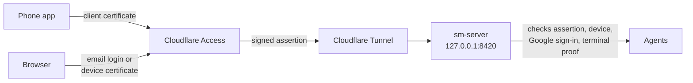

# Session Manager operator guide

How to install Session Manager on a Mac, run it as a service, use it from the
web dashboard and the phone, open it to remote access safely, and look up any
`sm` command. For what Session Manager is and why, see the
[README](../../README.md).

Contents:

1. [Install on macOS](#install-on-macos)
2. [Run it as a service](#run-it-as-a-service)
3. [Where things live](#where-things-live)
4. [The web dashboard](#the-web-dashboard)
5. [The Android app](#the-android-app)
6. [Remote access](#remote-access)
7. [Security model](#security-model)
8. [Command reference](#command-reference)
9. [Operating notes](#operating-notes)
10. [Waiting-state API](#waiting-state-api)
11. [The Rust rewrite, measured](#the-rust-rewrite-measured)

---

## Install on macOS

### Requirements

| Need | Why |
|---|---|
| macOS | The service runs under launchd; device certificates use the macOS keychain. |
| Rust 1.86 or newer | Builds the server and the `sm` CLI. |
| tmux | Every agent runs in its own tmux session. |
| git and the GitHub CLI `gh`, signed in | Tickets, PRs, reviews and worktrees go through GitHub. |
| Claude Code and/or the Codex CLI | The agents themselves. The server runs whatever `claude.command` and `codex.command` name in the config, `claude` and `codex` by default. |
| `/usr/bin/python3` | The restart and hook-install scripts use it. It ships with the Xcode command line tools. |
| A code-signing certificate in your login keychain | Only for running as a service; see [Signing](#signing). |

### Build and install the CLI

```bash
git clone https://github.com/rajeshgoli/session-manager
cd session-manager
cargo build -p sm-server --release
./scripts/install-sm-cli.sh
export PATH="$PWD/.local/bin:$PATH"     # add this to your shell profile too
```

The build produces two binaries, `sm-server` and `sm`. `install-sm-cli.sh`
copies `sm` to `.local/bin/sm` in the checkout, checks that the copy runs, and
refuses to install cargo's own output in place. Keep `.local/bin` on your
`PATH`: `cargo clean` deletes `target/`, and an `sm` that lived only there would
vanish, along with every agent's ability to run it.

`install-sm-cli.sh --skip-build` installs the existing `target/release/sm`
without rebuilding; `--source PATH` installs a given file.

### Configure

The server reads its config from `~/.config/session-manager/config.yaml`. Keep
it there, outside every checkout, so a branch switch or `cargo clean` cannot
touch it.

```bash
mkdir -p ~/.config/session-manager
cp config.yaml.example ~/.config/session-manager/config.yaml
```

The example is long; most of it is optional. The settings a working install
needs:

```yaml
# How sm names you in text it writes to agents. Default: Owner.
owner_name: "Sam"

paths:
  state_file: "~/.local/share/claude-sessions/sessions.json"
  # Set these two explicitly: their built-in defaults point inside the
  # checkout the server was built from.
  app_artifacts_dir: "~/.local/share/claude-sessions/apps"
  bug_reports_db: "~/.local/share/claude-sessions/bug_reports.db"

# Launch agents in tmux. Off by default: without it the server records new
# agents but never starts them.
rust_core:
  runtime_enabled: true

tmux:
  socket_name: "session-manager"   # agents get their own tmux server

claude:
  command: "claude"                # use an absolute path if the service can't find it
  args: ["--permission-mode", "auto"]
  default_model: "sonnet"

codex:
  command: "codex"
```

The listen address is not in the file. It comes from `sm-server`'s `--host`
and `--port` flags, which the service scripts set to `127.0.0.1` and `8420`.

The server ignores keys it does not recognise, so a misspelt key fails
silently. Check a config before using it:

```bash
target/release/sm-server --check-config --config ~/.config/session-manager/config.yaml --port 8420
```

It prints `configuration ok`, then the owner name and whether the optional
sign-in overlay, email bridge and phone push are set up. A missing overlay or
email bridge is fine for local use.

**People agents can message.** `sm send <person>` delivers to a person rather
than an agent. People are listed under `humans:` in `config/email_send.yaml`,
resolved next to `config.yaml` (so `~/.config/session-manager/config/email_send.yaml`).
Start from `config/email_send.yaml.example`; each entry's key and `aliases` are
the names agents can use. `sm roster` lists the people the server knows.

### Install the Claude Code hooks

```bash
./scripts/install_notify_server_hook.sh
```

This copies the hook scripts into `~/.claude/hooks/` and registers them in
`~/.claude/settings.json`. They tell the server when a Claude agent starts and
ends a turn, compacts, or clears, and report context usage. Without them the
server cannot tell a Claude agent is idle, `sm spawn` cannot confirm the agent
accepted its brief, and context handoff does not work. The installer also takes
over Claude Code's status line to read context usage; whatever status line you
had is kept and still shown.

The hooks post to `http://localhost:8420`. If the server listens elsewhere, set
`SM_HOOK_BASE_URL` in the environment Claude Code runs in.

### Try it in the foreground

```bash
target/release/sm-server --host 127.0.0.1 --port 8420 --config ~/.config/session-manager/config.yaml
```

Open <http://127.0.0.1:8420>, press **New agent**, and pick Claude or Codex. Or,
from another terminal:

```bash
sm spawn claude "say hello and exit" --name hello-agent
sm all
sm tail hello-agent
```

`sm all` prints each agent as `name (id) | provider | state | directory`. To end
the agent, `sm retire <id>` with the id from that list.

---

## Run it as a service

`scripts/restart-rust-server.sh` builds, signs, installs and starts the server
under launchd, and checks it is healthy. Use it for the first install and for
every restart after.

```bash
./scripts/restart-rust-server.sh
```

### Signing

The script signs the server with a persistent code-signing certificate and
refuses ad-hoc signing, so macOS treats each new build as the same program
and keychain and privacy permissions survive restarts.

1. Create a certificate: Keychain Access → Certificate Assistant → Create a
   Certificate, type **Code Signing**, in the login keychain.
2. Find its fingerprint: `security find-identity -v -p codesigning`.
3. Tell the script. `config/rust-server-signing.env` holds the maintainer's
   identity; override both values in your shell profile rather than editing it,
   because `--update` refuses a checkout with edited tracked files:

```bash
export SM_SIGN_IDENTITY=<40-hex fingerprint>
export SM_SIGN_DESIGNATED_REQUIREMENT='designated => identifier "com.rajeshgoli.sm-server" and certificate root = H"<same fingerprint, lowercase>"'
```

For a self-signed certificate the root is the certificate itself, so both lines
carry the same fingerprint. The script refuses to stop the running server if the
new build's signature does not match exactly.

### What a restart does

The service runs as one of two launchd jobs, `com.rajeshgoli.session-manager-rust.blue`
and `.green`. A restart builds into the idle one, checks the config with
`--check-config`, starts it, and hands the listening socket over from the
serving one, so agents and the dashboard see no gap. Only then does it stop the
old job. It finishes by checking `/health`, that the process stays up, that the
queue is served by the new process, and that no agent went missing, and it
refreshes the installed `sm`.

The serving binary is `.local/bin/sm-server-blue` or `-green`, with
`.local/bin/sm-server` pointing at it; `~/.local/share/claude-sessions/active-slot`
says which. launchd never runs cargo's output directly, so a `cargo build`
cannot replace a running server.

### Deploying updates

```bash
./scripts/restart-rust-server.sh --update
```

`--update` fast-forwards the checkout to `origin/main` under the restart lock,
then builds and restarts what it fetched. Deploy this way; never `git pull` in
the deployed checkout by hand. A pull while another restart is building moves
the source under that build, and the restart refuses to install a build whose
source changed.

| Flag | Use |
|---|---|
| `--update` | Fast-forward to `origin/main`, then build and restart. Refuses a checkout not on `main`, with edited tracked files, or with unpushed commits. |
| `--allow-behind-main` | Deploy a checkout that lacks commits on `origin/main`. Only for a deliberate rollback, or when GitHub cannot be reached. |
| `--allow-drop N` | Accept up to N agents missing after the restart (default 0). |
| `--allow-plist-change` | Go ahead although the launchd job definition would change. Read the printed diff first. |
| `--skip-build` | Re-sign and reinstall the binary already installed. |
| `--adopt` | One-time migration for a service still registered against `target/release/sm-server`. Run as `--adopt --allow-plist-change`, then restart normally. |

The script picks the config at `~/.config/session-manager/config.yaml` and falls
back to `config.yaml` in the checkout only when that file is missing.

### Checking on the service

```bash
curl -s http://127.0.0.1:8420/health          # {"status":"healthy"}
./scripts/rust-service-cutover.sh status      # launchd job, port, health
tail -f ~/.local/share/claude-sessions/launchd-logs/rust-launchd.err.log
```

The launchd job restarts the server if it crashes.

---

## Where things live

| Path | Holds |
|---|---|
| `~/.config/session-manager/config.yaml` | Server config. |
| `~/.config/session-manager/config/email_send.yaml` | People agents can message, and the email bridge. |
| `~/.config/session-manager/.local/android-parity/values.env` | Optional sign-in overlay for remote access (see [Google sign-in](#google-sign-in)). |
| `~/.config/session-manager/certs/` | The phone and browser device certificate authority. |
| `~/.config/session-manager/client.yaml` | Optional `api_url:` for `sm` when the server is not at `http://127.0.0.1:8420`. |
| `~/.local/share/claude-sessions/` | All state: `sessions.json` (agents), `message_queue.db` (messages, reminders, review requests), `queue-runner/` (jobs and their logs), `usage.db`, `activity.db`, `notes.db`, `mobile_devices.db`, `owner_push.db`, `apps/` (phone app builds), `launchd-logs/`. |
| `<checkout>/.local/bin/` | Installed `sm` and `sm-server`. |

`sm` finds the server through, in order: `--api-url`, the `SM_API_URL`
environment variable, `api_url` in `client.yaml`, then `http://127.0.0.1:8420`.

---

## The web dashboard

The server serves the dashboard itself. On the Mac it runs on, open
<http://127.0.0.1:8420> or <http://localhost:8420>: no sign-in is needed from
the same machine. A LAN address or any other hostname is not treated as local
and needs [remote access](#remote-access).

| Page | Path | What you do there |
|---|---|---|
| **Agents** | `/` | Every agent, sorted by what needs attention or grouped by repo. Open a card to see its work, activity and a summary; message it; open its terminal; hand it off to a fresh agent; clone it; retire it; or pin a note. |
| **Board** | `/board` | Tickets under each goal, what each waits on, and who works it. **Start** a ticket with an agent preset, or arm **When ready** so it starts when its prerequisites are done. Add a lane, close a ticket. |
| **Queue** | `/queue` | Running and waiting jobs by type, over a live chart of CPU and memory. Open a job for its log; cancel it; ask the agent that submitted it. |
| **Inbox** | `/inbox` | Messages and documents agents sent you, threaded per agent. Reply in place; the agent carries on. |
| **Notes** | `/notes` | Your markdown notes with revision history. Start an agent or file a GitHub issue from a note. |
| **Analytics** | `/analytics` | Spend and time by provider, model and agent, and why jobs were held back. |
| **History** | `/history` | Retired agents (bring one back with **Restore**) and every ticket and PR with its agents, reviews and documents. |
| **Guestbook** | `/guestbook` | Notes agents leave when they finish (`sm task-complete --sign-guestbook`). |
| **Settings** | `/settings` | Defaults for new agents, context handoff, review policy, queue limits, terminals, phone notifications, devices and access, leftover worktrees. |
| **Terminal** | `/terminal/<id>` | A full terminal attached to the agent's tmux session, with an agent switcher. |

The top bar holds search (⌘K), the queue count, a bug-report button and **New
agent**. Press `g` then `a`, `b`, `q`, `i`, `n` or `s` to jump to Agents, Board,
Queue, Inbox, Notes or Settings. ⌘J opens notes over any page. On the Agents
page, `j`/`k` move, `Enter` opens a card, `t` opens its terminal. In the Inbox,
`e` marks a thread done and `y` archives it.

### Messages that need you

An agent writes to you with `sm send <you>`. A message sent with `--blocking`
shows as **Needs you** in the Inbox and on the agent's card until you reply or
mark it answered. Replying to a retired agent brings it back.

### Reviewing documents

An agent publishes a document with `sm doc publish <path> --pr <N> --review`.
It appears in the Inbox under **Docs** and needs you until you review it.
Select any sentence to leave a comment, then **Review** to approve, request
changes, or comment, optionally holding the merge. Your review lands on the PR
as one GitHub review with each comment quoting its sentence, and wakes the
agent with `[sm review]`. **Ask** puts a question to the document's author,
who answers in your Inbox.

### Rebuild the demo

<https://sm-demo.rajeshgo.li> replays a recorded sprint in this dashboard,
built from `web-demo/` (its `README.md` has the details). Cloudflare Pages
builds and deploys it from `main` whenever a push changes `web-demo/` or
`crates/sm-server/src/web/`, so a dashboard change reaches the demo on merge.

1. **Regenerate the recording** when the dashboard's data calls change (new
   pages or fields the recording lacks). It plays in real time, about ten
   minutes. From a shell, run `python3 web-demo/generate/record.py`; an agent
   submits it to the queue instead:
   `sm queue run --type background --max-wait 2h --timeout 30m --label demo-record --cwd <repo> -- python3 web-demo/generate/record.py`
2. **Rebuild and check it locally:** `python3 web-demo/build.py --serve`, then
   open <http://localhost:8440/>.
3. **Redeploy** by merging the change to `main`. To redeploy without a
   change, use **Retry deployment** on the `sm-demo` project in the Cloudflare
   Pages dashboard.

---

## The Android app

The app shows the same agents, Inbox and document reader on the phone, opens
terminals, and delivers push notifications. It reaches the server through
[remote access](#remote-access), so set that up first.

### Build

The app is built from `android-app/` with JDK 17 and the Android SDK. Its
settings live in `android-app/local.defaults.properties`, which git ignores;
start from `android-app/local.defaults.properties.example`:

| Key | Value |
|---|---|
| `SM_DEFAULT_SERVER_URL` | `https://` plus the phone hostname. |
| `SM_GOOGLE_SERVER_CLIENT_ID` | Your Google web client id. |
| `SM_LINK_HOST` | The browser hostname, so document links open in the app. |
| `SM_FIREBASE_PROJECT_ID`, `SM_FIREBASE_SENDER_ID`, `SM_FIREBASE_APP_ID`, `SM_FIREBASE_API_KEY` | From the Firebase project for push notifications; the Android app id is `li.rajeshgo.sm`. |

```bash
cd android-app
SM_VERSION_CODE=2 SM_VERSION_NAME=0.1.1 ./gradlew assembleDebug
cd ..
```

### Publish and install

```bash
VERSION_CODE=2 VERSION_NAME=0.1.1 RELEASE_NOTES="What changed and what to try." ./scripts/deploy_android_app.sh
```

The script checks the build carries every value above (it refuses one that
would ship without sign-in or push), then uploads it to the local server. The
server keeps it under `paths.app_artifacts_dir` and serves
`/apps/session-manager-android/meta.json` and `/apps/session-manager-android/latest.apk`.
Release notes are required, up to 1,000 characters.

Install the first build by hand, for example
`adb install android-app/app/build/outputs/apk/debug/app-debug.apk`. After
that the app checks `meta.json`, shows the release notes when a new build is
published, and installs it through Android's installer.

### Enroll the phone

```bash
sm enroll-device --config ~/.config/session-manager/config.yaml
```

Pass `--config`: the default is `config.yaml` in the current directory, and a
missing file loads built-in defaults and fails with a confusing message about
`mobile_terminal.allowed_users`.

The command prints a QR code and listens on port 19192 of the Mac for 15
minutes. Scan it with the phone's camera on the same network; the link opens
the app, which sends a certificate request. The command issues a certificate
for the phone, stores it, and adds the phone to the Cloudflare Access policy,
then exits. The certificate lives inside the app and is never shown.

Useful flags: `--user-id` picks the user from `mobile_terminal.allowed_users`
when more than one may open terminals; `--url-base` sets the address the QR
points to when the phone cannot reach the Mac's LAN address; `--no-qr` prints
only the URL.

```bash
sm list-devices                 # enrolled phones and computers
sm remove-device <device-id>    # revoke one
```

Removing a device revokes it in Session Manager at once, ends its open
terminals, deletes its push registration, and removes it from the Cloudflare
Access policy when `cloudflare_access.account_id`, `api_token` and
`mobile_device_policy_id` are set.

---

## Remote access

By default the server listens only on `127.0.0.1` and has no sign-in.
Remote access puts Cloudflare in front of it with two hostnames, each a
separate Cloudflare Access application:

| Hostname | Used by | Access application gate |
|---|---|---|
| Browser, e.g. `sm.example.com` | The web dashboard from other computers | Email login for an allowlisted address, or an enrolled Mac's certificate. |
| Phone, e.g. `sm-app.example.com` | The Android app | Mutual TLS: only enrolled phone certificates connect. |

A Cloudflare Tunnel on the Mac forwards both hostnames to
`http://127.0.0.1:8420`.



### Cloudflare settings

All under `cloudflare_access:` in `config.yaml`:

| Key | Value |
|---|---|
| `account_id`, `api_token` | The account and an API token that may edit Access applications, Access policies and mTLS certificates. The server and `sm enroll-device` use them to keep the device policy current. |
| `zone_id` | Optional; looked up from the hostname when blank. |
| `team_domain` | `<team>.cloudflareaccess.com`. |
| `browser`, `mobile_app` | Each `enabled`, `app_id`, `hostname`, and `jwt_audience` (the application's audience tag, needed to verify its assertions). |
| `browser.device_policy` | `true` to allow Mac device certificates on the browser hostname. Off by default. |
| `mobile_device_policy_id` | The reusable Access policy that lists enrolled devices. |
| `mobile_device_ca_certificate_id` | Optional; the server uploads the device certificate authority and finds it by name when blank. |

Terminals on the phone also need `mobile_terminal.enabled: true`, an entry
under `mobile_terminal.allowed_users` with your email and
`interactive_shell_access: true`, and absolute paths for
`mobile_terminal.device_ca_cert_path` and `device_ca_key_path` (they resolve
against the server's working directory otherwise). `sm enroll-device` creates
the certificate authority at those paths the first time.

### Google sign-in

The phone app signs in with Google after its certificate is checked. Set
`auth.google` in `config.yaml`, or put the secrets in the overlay file
`~/.config/session-manager/.local/android-parity/values.env`, which the server
reads at start and which keeps them out of the main config:

```
GOOGLE_WEB_CLIENT_ID=...
GOOGLE_WEB_CLIENT_SECRET=...
GOOGLE_ANDROID_CLIENT_ID=...
ALLOWLIST_EMAIL=you@example.com
PUBLIC_HTTP_HOST=sm-app.example.com
```

The allowlisted emails are the owner. A browser email login through Cloudflare
Access must also be one of them.

### Phone push notifications

```yaml
push:
  fcm:
    service_account_path: "~/.config/session-manager/fcm-service-account.json"
```

The file is a Google service-account key for the Firebase project the app was
built with. Without it, notifications you follow arrive by email instead.
**Settings → Notifications** lists registered phones and sends a test.

### Mac browser certificates

With `browser.device_policy: true`, a Mac can sign in to the browser hostname
with a certificate instead of an email login. Keep the email policy as a
fallback.

```bash
sm device enroll <name>               # name: lowercase letters, digits, dashes; never reused
sm device repair-key-access <name>    # fix an older key that keeps asking Chrome for permission
```

`sm device enroll` creates a non-exportable key in the login keychain, gets a
certificate from the server, and tells Chrome to present it for the browser
hostname. Run it against the local server, or remotely with
`--api-url https://<browser hostname>` (that needs `cloudflared` for the owner
login). Then **quit Chrome completely and reopen it**; reloading a tab can keep
an old connection. **Settings → Devices & access** should show the certificate
name, and a terminal should connect.

Chrome's certificate sign-in can fail over HTTP/3. A Cloudflare Response
Header Transform Rule scoped to the browser hostname (match
`http.host eq "sm.example.com"`) that removes the `Alt-Svc` header keeps Chrome
on HTTP/2 for that host without turning HTTP/3 off for the zone; this passed
certificate sign-in and terminal input on the maintainer's machines.
[Cloudflare documents the rule](https://developers.cloudflare.com/speed/optimization/protocol/troubleshooting/protocol-troubleshooting/#resolution),
and notes browsers can cache the old advertisement for up to 24 hours. Turning
HTTP/3 off for the zone is the broader fallback.

`repair-key-access` changes only the existing key's signing permissions and
its prompt name; it keeps the key, its certificate and other permissions.
macOS asks you to authorize the change.

To back out, set `browser.device_policy: false` and restart, then remove the
browser hostname from the device certificate authority's hostname associations
in Cloudflare, before undoing the `Alt-Svc` rule. Changing the config alone
leaves the Cloudflare association in place.

### Partner access to board auto-start

A partner application that already holds your Cloudflare Access login can arm
and disarm **When ready** on the Board for you. List its audience tag:

```yaml
partner_access_audiences:
  - "partner-application-audience-tag"
```

Only `PUT /client/board/auto-start` accepts the partner's
`x-sm-partner-assertion` header, and only on a direct local request with no
proxy forwarding headers. The server verifies the assertion's signature
against `team_domain`, its audience, expiry, and that its email is an owner.
Every other route ignores the header.

---

## Security model

**On the Mac.** A request is trusted without sign-in only if it comes from the
loopback interface *and* names `127.0.0.1`, `localhost` or `::1` as its host.
The Cloudflare Tunnel also connects from loopback, but names the public
hostname, so tunnelled traffic is never trusted this way. Anyone who can run
programs as your user can drive Session Manager; that is the same trust the
agents already have.

Sandboxed local-model agents do not get this trust. They reach the server
through a per-agent gateway that signs each request, and the server limits
them to their own work: they cannot read your Inbox, settings, notes or
terminals.

**From the internet**, the phone path has four layers:

1. **Cloudflare Access, mutual TLS.** The connection fails without a client
   certificate issued by your device certificate authority and listed in the
   Access policy.
2. **Origin check.** The server verifies Cloudflare's signed assertion (team,
   audience, expiry) and checks the certificate belongs to an enrolled,
   unrevoked device in its own records, so a stale Cloudflare policy is not
   enough.
3. **Google sign-in.** A verified Google account on the allowlist, matching
   the device's owner, gets a 14-day token.
4. **Terminal proof.** Opening a terminal needs a 30-second, single-use
   ticket signed by a key held in the phone's Android keystore, which cannot
   be exported.

The browser path is Cloudflare Access email login (or an enrolled Mac
certificate) for an allowlisted owner; changes from the browser must also come
from the dashboard's own origin.

Revoking a device (`sm remove-device` or **Settings → Devices & access**)
takes effect in the server immediately, even before Cloudflare's policy
updates. If the phone cannot connect, check in order: Cloudflare Access mutual
TLS, then Google sign-in, then the terminal proof.

---

## Command reference

`sm --help` and `sm <command> --help` are authoritative. Agents run most of
these; the commands an operator uses directly are marked **op**.

Commands that take `<id>` need the agent's id as `sm all` prints it.
`sm send` and the reparent commands also accept a name, role or id prefix.
Commands marked *agent only* need to run inside a managed agent (they read
`SESSION_MANAGER_ID` or `CLAUDE_SESSION_MANAGER_ID`).

### Agents

| Command | What it does |
|---|---|
| `sm spawn <provider> <prompt>` | Start an agent with a brief. Providers: `claude`, `codex`, `codex-original` (stock Codex). Give the brief inline, with `--prompt-file <path>`, or with `--prompt-stdin`. Options: `--name`, `--model`, `--effort`, `--working-dir`, `--wait <seconds>`, `--ticket <N>` (the agent claims the ticket before its first turn), `--json`. From a plain shell the agent has no parent. **op** |
| `sm claude [dir]`, `sm codex [dir]`, `sm codex-original [dir]` | Start an interactive agent in `dir` and attach to it. `sm new` is the same as `sm claude`. **op** |
| `sm all` | List every agent. **op** |
| `sm status` | List agents; `sm status "<text>"` sets your own one-line status (*agent only*). **op** |
| `sm me`, `sm who` | Your own agent; other live agents in your directory. *agent only* |
| `sm name <new-name>` / `sm name <id> <new-name>` | Rename yourself, or one of your children. *agent only* |
| `sm children [<id>]` | An agent's children. `--recursive`, `--terminated`, `--status`, `--usage`, `--json`. |
| `sm tail <id>` | Recent activity; `--raw` for the rendered terminal, `-n` lines. **op** |
| `sm output <id>` | Recent terminal output with control codes; `--lines` (default 50). |
| `sm attach <id>` | Attach to the agent's tmux session. **op** |
| `sm wait <id> <seconds>` | Wait until the agent is idle or stopped; fails on timeout. |
| `sm what <id> [question]` | Ask a running agent a side question without disturbing its main thread. From a plain shell it waits for and prints the answer. **op** |
| `sm clear <id> [prompt]` | Clear a child agent's context, optionally with a new brief. |
| `sm retire <id>` | Stop an agent and clean up its worktree when nothing would be lost. **op** |
| `sm restore <id>` | Bring a retired agent back with its conversation. **op** |
| `sm handoff [file]` | After this turn, start a fresh agent of the same kind with this note, move claims, children and pending wakes to it, and retire this one. `--link <url>` for a note in a PR or ticket comment. *agent only* |
| `sm context [<id>]` | Context-window usage. `--details`, `--json`. |
| `sm context-monitor [status \| enable \| disable]` | Get notified when an agent's context passes thresholds (`--threshold <percent>`, repeatable). |
| `sm subagents <id>` | A Claude agent's built-in subagents. |
| `sm recredential [<id>]` / `--all-live` | Give an agent a fresh credential when one of its commands reports a missing credential. **op** |
| `sm reparent request <child> --to <parent>`, `approve`, `reject`, `status`, `repair` | Move an agent under a different parent, with approval. `sm adopt <child>` requests it under yourself; `sm reparent-tree <source> --to <target>` moves a whole subtree (`--dry-run`). |

### Messages and wake-ups

| Command | What it does |
|---|---|
| `sm send <target> <text>` | Send a durable message. Delivered when the target agent is next idle; `--urgent` interrupts it now; `--wait <seconds>` reminds you that long after delivery. Omit the text or pass `-` to read stdin. To a person, the text is markdown in the sm app; `--title` and `--blocking` (you cannot continue until they answer) apply only to people. **op** for agents |
| `sm remind <seconds> [message]` | Wake yourself after a delay in whole seconds. `--recurring` repeats it; `sm remind cancel <id>` cancels one. *agent only* |
| `sm email <recipient> [message]` | Send email through the configured bridge. `--subject`, `--body`, `--text <file>` (markdown rendered), `--html <file>`, `--cc`. *agent only* |
| `sm task-complete` | Mark your task done and notify your parent. `--sign-guestbook [text]` leaves a guestbook note. Run it last: a later message reopens the task. *agent only* |
| `sm turn-complete` | Mark the end of a turn. *agent only* |

Quote messages containing backticks or `$()` as a heredoc so the shell leaves
them alone:

```bash
sm send <target> - <<'EOF'
Review `src/lib.rs`; $(this) is not run.
EOF
```

### Roles

| Command | What it does |
|---|---|
| `sm register <role>`, `sm unregister <role>` | Register yourself under a role name others can `sm send` to. *agent only* |
| `sm maintainer [--clear]` | Register as, or stop being, the `maintainer` role. *agent only* |
| `sm lookup <role>` | The agent holding a role, or a person's delivery details. |
| `sm roster` | All registered roles and configured people. **op** |

### Job queue

| Command | What it does |
|---|---|
| `sm queue run [--type T] --label L --cwd D -- <command>` | Queue a job; the submitter is woken with `[sm queue]` when it finishes. Types: `tests` (default), `perf` (machine to itself; needs `--cpu`, `--memory`, `--timeout`), `background` (a perf job may stop it), `service` (long-running). `--memory 64G` on any type stops the job as `memory_exceeded` if its processes exceed it, `--timeout 90s`/`2h`, `--max-wait` (default 5m), `--env K=V`, `--script-file`. From a plain shell, name who to wake with `--notify <id>`. |
| `sm queue list` | Active jobs; `--all` adds finished ones and every submitter, `--state`, `--type`, `--json`. **op** |
| `sm queue status <label-or-id>` | One job and what it is waiting on, naming the jobs ahead of it. **op** |
| `sm queue log <label-or-id>` | The job's output; `--lines` (default 200). **op** |
| `sm queue cancel <label-or-id>` | Cancel a job. **op** |

`sm queue --help` explains how the types share the machine.

### Local models

| Command | What it does |
|---|---|
| `sm model status` | The loaded local model, if any. **op** |
| `sm model load <key>` | Load a local model. `--seats`, `--context`, `--reservation <GB>`. **op** |
| `sm model unload` | Unload it once local agents finish their turns; `--force` stops them now. **op** |

### Tickets, PRs, reviews and documents

| Command | What it does |
|---|---|
| `sm ticket [N]` | Claim ticket N (or list your claims). `--setup-worktree` creates its worktree; `--release N` ends a claim; `--take` takes it from another live agent. *agent only* |
| `sm pr [N]` | Claim a PR, by default the current branch's. `--ticket T` links tickets. *agent only* |
| `sm board` | Print the board. `sm board after <ticket> <blockers>...` records order, `sm board under <ticket> <parent>` makes a sub-issue, `sm board lane add <goal>` adds a lane, `sm board waiting <ticket> --text --url` marks a ticket waiting on you outside sm (`--clear` to clear). **op** |
| `sm request-review [PR]` | Ask for a review of a PR (default: current branch's). sm picks the reviewer, moves on if one fails, and wakes you with `[sm review]` when it lands. `--steer <text>` adds instructions. `list`, `status`, `cancel` manage requests. |
| `sm review submit` | A paired reviewer returns its review as JSON (`--file` or stdin); sm posts it. *agent only* |
| `sm merge-hold [N]` | Hold a PR from merging (it becomes a draft); `--release N`; no number lists holds. **op** |
| `sm doc publish <path>` | Publish a committed, pushed document for you to read. `--pr N` ties it to a PR; `--review` asks for your review. *agent only* |
| `sm doc cat <doc>` | Print a published document or local HTML file as compact markdown; `--out` saves it. **op** |
| `sm doc list`, `sm doc show <doc>`, `sm doc retract <doc>` | List documents, show one's revisions and reader URL, or hide one. **op** |
| `sm history` | Tickets and PRs with their agents, PRs, documents and reviews; `--item N` for one timeline. **op** |
| `sm worktree list`, `sm worktree delete <path>`, `sm worktree keep` | Leftover worktrees of retired agents and why they were kept; delete one (`--build-only` for just build output); keep yours past retirement (`--reason`). **op** |

### Dashboard, usage and devices

| Command | What it does |
|---|---|
| `sm watch` | Terminal dashboard of agents, jobs and reviews. Refuses to run inside an agent. See [The terminal dashboard](#the-terminal-dashboard). **op** |
| `sm usage [agent]` | Token and quota usage. `--account`, `--by-model`, `--history`, `--include-children`, `--json`. Needs `usage.enabled` in the config. **op** |
| `sm bug show <id>` | A bug filed from the dashboard or app: text, page data, server facts, screenshot. **op** |
| `sm enroll-device`, `sm list-devices`, `sm remove-device <id>` | Phone enrollment and device list; see [Enroll the phone](#enroll-the-phone). **op** |
| `sm device enroll <name>`, `sm device repair-key-access <name>` | Mac browser certificates; see [Mac browser certificates](#mac-browser-certificates). **op** |

`sm subagent-start` and `sm subagent-stop` are called by Claude Code hooks,
not by hand. `sm fork` is listed in `sm --help` but not implemented.

---

## Operating notes

### The terminal dashboard

`sm watch` shows agents as a tree with their jobs and review requests. `j`/`k`
move; `Tab` expands an agent, or opens a job's live output (press again for
full screen); `J` opens the selected agent's jobs, where `g` switches to all
jobs and `t` tails a log; `Enter` attaches to an agent; `s` sends it a message;
`K` twice within five seconds retires it; `/` filters; `?` lists every key;
`q` quits. `sm watch --restore` browses retired agents to bring back.

### The queue

Every job has a durable id and a label; `sm queue status`, `log` and `cancel`
accept either. A waiting job's status names what it waits for: a performance
job's quiet window, test fairness, a type's concurrency limit, or the cooldown
after a performance run. A job that cannot start within its `--max-wait`
(default five minutes) is not started, and its submitter is told. Logs are in
`~/.local/share/claude-sessions/queue-runner/logs/`, one per job, named
`<label>--<id>.log`. **Settings → Queue limits** changes concurrency without a
restart.

### Usage ledger

`usage.db` records token use per agent per minute. A token can count towards
more than one quota window, so never sum across `window_kind`. The
`current_seat_token_totals` view keeps each agent's current window:

```bash
sqlite3 ~/.local/share/claude-sessions/usage.db \
  'SELECT seat_id, window_kind, SUM(input_tokens + output_tokens + reasoning_tokens + cache_write_5m + cache_write_1h + cache_read_tokens) AS tokens FROM current_seat_token_totals GROUP BY seat_id, window_kind;'
```

### Testing a change

```bash
scripts/test-rust-isolated.sh                         # cargo test with state isolated from the live server
cargo clippy -p sm-server --all-targets -- -D warnings
cargo fmt -p sm-server --check
cd android-app && ./gradlew testDebugUnitTest assembleDebug
```

---

## Waiting-state API

`GET /session-obligations` is a read-only snapshot of what each agent waits on,
for clients that decorate agent lists. It returns `schema_version: 4` and a
`sessions` array; join each entry's `session_id` to `/sessions`. An entry has:

- `waiting_on`: open obligations, each with `kind`, `id`, `label` and `since`.
  Kinds:
  - `queue_job`: a pending or running job, with `state` and
    `requester_session_id`.
  - `review`: an active review request, with `state`, `repo`, `pr_number`,
    `requester_session_id`, `last_polled_at` and `last_error`.
  - `owner_review`: a document waiting for the owner's review.
  - `owner_message`: a blocking message waiting for the owner's answer.
- `waiting_since`: the oldest `since` in `waiting_on`, or null.
- `review_history`: per PR, `repo`, `pr_number`, `scope: "sm_tracked"`,
  `request_count`, `requested_by_agent`, `landed_count` and
  `landed_requested_by_agent`. Landed reviews are counted once per review URL.
- `docs`, `claims` and `messages`: the agent's published documents, claimed
  tickets and PRs, and messages to the owner.

Show an agent as waiting only when it is **idle** and `waiting_on` is not
empty; leave its activity state unchanged. An agent missing from a successful
snapshot has no obligations. On a failed request, show the state as unknown
rather than empty. The endpoint makes no GitHub calls. For individual review
records, use `GET /review-requests?include_inactive=true&repo=OWNER/REPO&pr_number=N`.

To mark a ticket as waiting on the owner outside sm, `PUT /board/waiting` with
`{repo, number, text, url}` (text up to 120 characters, an `https` URL) or
`{repo, number, clear: true}`; `sm board waiting` does the same.

---

## The Rust rewrite, measured

Session Manager began as a Python service. A side-by-side run on 2026-06-12
measured the Rust server against it, with three samples per figure; the Python
service ran on live state, the Rust one beside it on a copy:

| Metric | Python service | Rust service | Change |
| --- | ---: | ---: | ---: |
| Memory (RSS) | 154.7 MiB | 19.8 MiB | about 87% lower |
| Physical footprint | 66.4 MiB | 6.7 MiB | about 90% lower |
| `/health` median | 4.17 ms | 0.28 ms | about 15× faster |
| `/client/bootstrap` median | 6.62 ms | 0.30 ms | about 20× faster |
| `/sessions` median | 25.75 ms | 7.97 ms | about 3× faster |
| `/client/sessions` median | 58.49 ms | 7.95 ms | about 7× faster |

A one-off comparison, not a controlled benchmark, but the direction is clear.
