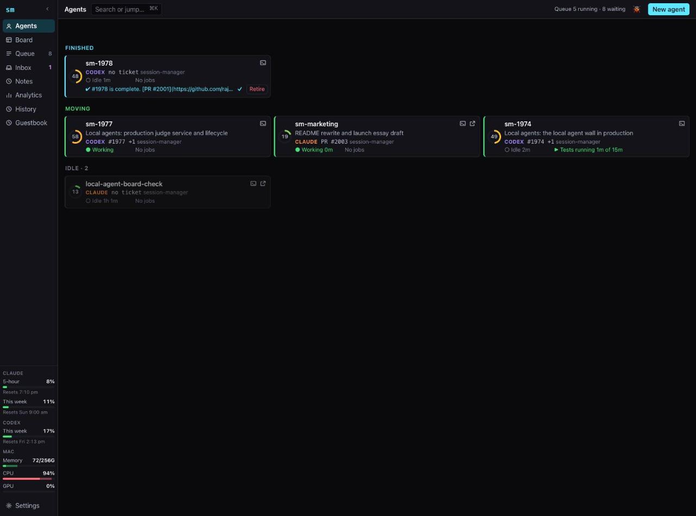

# Running coding agents like an engineering team

*Rajesh Goli · draft for launch · prepared by `sm-marketing` (db9c55e5)*

<!-- Bracketed notes like [Rajesh: …] mark material only you can supply. Delete them before publishing. -->

Modern coding agents are good enough that you can hand one an entire epic and
tell it to keep going until it's done.

This summer I did that with a large piece of my research codebase. An
orchestrating agent got the epic, wrote a plan of 32 to 34 tickets, and ran
it with helper agents. The first tickets closed in a day or two. Then they
stretched to days each, and some stayed open for three weeks. The 34 planned
tickets became about 91 issues and 95 pull requests. Eighteen days in, I froze
the lane: 32 live agent sessions, 275 worktrees, and a branch nearly 200,000
lines ahead of main with 13 merge conflicts. Not one ticket-level pull
request was safe to merge. My weekly quota read 79%, 85%, 89%, 92% over four
days. I closed the epic a month after opening it and rebuilt the work from
scratch on main.

[Rajesh: if you have one, a completion estimate the orchestrator gave you and
what actually happened. The repo has no estimates on record.]

The agents weren't the problem. They wrote good code in small pieces. The
problem was that nothing about the setup told me where the work stood, why it
was late, or where the quota went. I had a transcript and an estimate, and the
estimate was a guess. When I measured it, driving the agents myself was three
to four times more token-efficient than letting an orchestrator agent drive
them. My note that week: "No orchestrator. That model is dead. I'm the
orchestrator."

Being the orchestrator by hand doesn't scale, though. What I needed was the
orchestrator's job done by something that spends no tokens and doesn't lose
track.

## A team, not a genius

A good engineering team doesn't give one engineer the whole roadmap and check
back in a month. It plans the work into tickets, orders them by dependency,
gives each to the person suited to it, has someone else review the result,
and schedules shared resources like the test machine instead of fighting over
them. At any point the lead can look at the board and say when the work will
land, and why if it won't.

None of that depends on the workers being human. So I built the structure for
agents, and called it Session Manager.

## What changed

A month later the same codebase ran as planned sprints. Each iteration
started with a plan memo: a fixed set of tickets, a prediction of when the
result would land, and a table of a dozen decisions only I could make, each
with a recommendation.

Iteration 7 planned 14 tickets and a readout about 28 hours after approval.
It took 53. A design question discovered midway changed the hardware plan,
and eight tickets were added for the new work. Each appeared as a ticket I
could see, not as a silent detour in a transcript. Iteration 8 planned 11
tickets and a readout in two to three days. It landed in 2.9. Individual
tickets missed both ways (one planned at three hours took one, another
planned at five took eight), but the sprint landed when the plan said. When a
cheap probe showed one planned input wasn't worth having, it came to me as a
decision, and I dropped it. By iteration 9, the board showed where the wall
time went: agents working, waiting for the machine, or waiting on me.

A late sprint with a breakdown of where the time went is something you can
fix. A late agent with a transcript is something you can only wait on.

## How Session Manager works

Session Manager runs Claude and Codex agents as real terminal sessions on my
own machine, drawing on all my subscriptions at once. A goal becomes tickets
with dependencies, each sized so that one agent can finish it without running
out of context. Each ticket goes to a model matched to it: the strongest model
for design and specs, a mid-tier model for implementation and review, a cheap
one for mechanical work.

Coordination lives in the server, not in an agent. When a ticket's
prerequisites finish, its agent starts. When a test job finishes, the agent
waiting on it wakes. When a pull request is ready, a reviewer from a different
model picks it up. An agent with nothing to do sits idle and costs nothing. No
tokens go on an agent supervising other agents.

The server also watches each agent's context. Before an agent fills its
window, the server hands the work to a fresh successor with a brief, instead
of letting the agent compact its memory. Every transcript survives intact, so
weeks later I can read exactly what an agent saw and why it decided what it
did.

Tests, benchmarks and GPU jobs go through a queue. A benchmark can have the
whole machine to itself, so its numbers mean something.

I run all of it from a web dashboard, and from the same view on my phone. The
Agents page sorts every agent into three groups: needs me, moving, idle. The
Board shows each goal's tickets, what they wait on, and who is working them;
a ticket can be armed to start the moment its prerequisites land. The Queue
page overlays jobs on the machine's CPU, GPU and memory. Quota meters for each
subscription sit on every page. Questions from agents arrive in an inbox I can
answer from anywhere.

Running local models as agents on the same machine is the newest part. It
deserves its own post.

## Built by the method it implements

Agents wrote all of Session Manager's code. I didn't write a single line. I
wrote the goals, read the specs, made the decisions only I could make, and
reviewed what needed my judgment. Everything else ran through Session Manager
itself.

That makes it a fair test of the method. If agent teams produce slop, this
would be slop. Since late January, the repository has taken about 950 merged
pull requests, each starting from a ticket. Larger changes start as a written
spec, reviewed before any code is written. 194 of the last 200 merged pull
requests carry a review. The server is about 200,000 lines of Rust with about
1,700 automated tests, and lint and format checks must pass before a pull
request opens. The Rust server replaced an earlier Python one and uses about
87% less memory, with common reads 3 to 20 times faster. Remote access goes
through mutual TLS, then sign-in at the server, then a separate check before
any terminal opens.

Whether code is slop has little to do with who typed it. It depends on
whether a plan, a review and a test stand between the code and the main
branch. Agents work inside that discipline as well as people do, once
something holds them to it.

## What I learned

[Rajesh: drawn from your standing instructions to agents and your review
comments on session-manager. Keep the ones that are yours, reword freely.]

A ticket is what one agent can finish without compacting its memory. If it
doesn't fit, split it before anyone starts.

Match the model to the work. The strongest model writing boilerplate wastes
quota; a cheap model designing a system wastes time. Running out of quota
stops everything for days, so when cost and speed conflict, I spend time.

Don't put yourself in the agent's loop. If an agent has to wait for me before
it can take its next step, it stops. Agents should bring me decisions, with a
recommendation, and carry on with everything else.

"Done" means merged, not opened. In the failed epic, the driving agent
counted an opened pull request as a finished ticket in 6 of 40 tickets.

Never let an agent grade its own work. A second model reviewing the pull
request catches what the first one talked itself into. Review findings get
classified as valid or invalid, with reasons, rather than accepted wholesale.

When something hasn't been measured, the next ticket measures it. Guesses
about context size, memory or speed become tickets on the board instead of
assumptions in a spec.

## When not to bother

If the job is small, or it's exploration you can't plan, give it to one agent.
Planning has a cost, and Session Manager runs a lone agent fine as one card on
the dashboard. The team model pays off when the work is big enough that you'd
want a plan if people were doing it.

## Try it

There's a [live demo](https://sm-demo.rajeshgo.li) of a team running a
sprint, and the code is on
[GitHub](https://github.com/rajeshgoli/session-manager) under the MIT
license. The tool gives you building blocks: agents, messages, a job queue,
reviews, a board. How I use them is one way among many.
